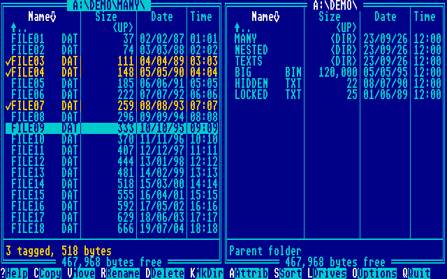
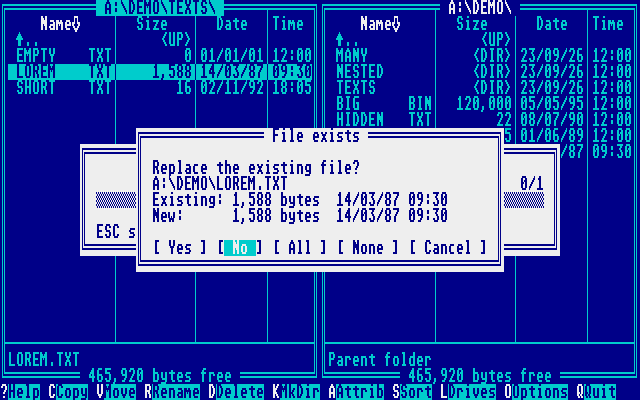
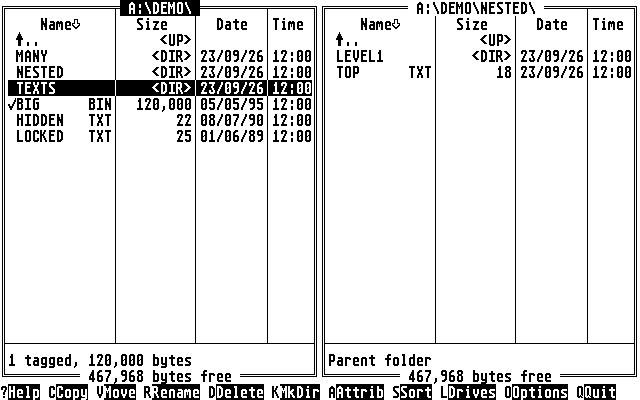

<div align="center">

# TOS File Cmd

**Two panels. One Atari ST.**

A two-panel file manager for the Atari ST, STE and Mega ST.\
Copy, move, rename and delete files and whole folders — every copy read back and checked.

**[Manual](docs/MANUAL.md) · [Changelog](CHANGELOG.md) · [Data safety](docs/DATA-SAFETY.md) · [Roadmap](TODO.md)**



*80 columns in medium or high resolution. Keyboard and mouse. Boots from a single floppy.*

</div>

Inspired by [A2 File Cmd](https://github.com/habib256/a2filecmd) and Norton
Commander, TOS File Cmd (TOSFC) brings the source-and-destination workflow to
GEMDOS: a folder on each side, a bar of commands at the bottom, and the
file you want is always two keys away. Tag a batch, press **C**, and it is on
the other side — written, closed, read back and compared.

## What version 0.1 does

| | |
|---|---|
| **Browse** | Two panels on any GEMDOS drive: floppies, hard disk partitions, RAM disks. Folders first, sorted by name, extension, size, date or disk order. Hidden and system files shown or hidden. Up to 1,024 entries per folder. |
| **Manage files** | Copy, move, rename, delete and make folders. Tag files with SPACE, whole folders included. A progress bar for long jobs, ESC to stop. |
| **Stay safe** | Copies are verified byte for byte. A replaced file is kept as `TOSFC.BAK` until its successor is checked, and put back if anything fails. A move deletes its source only after a full comparison. Delete asks first and defaults to Cancel. Disk errors get TOSFC's own Retry/Cancel box. See [data safety](docs/DATA-SAFETY.md). |
| **Attributes** | Read-only, hidden, system and archive bits, for one file or a tagged batch. |
| **Mouse or keyboard** | Click to select, click again to open, right-click to tag; click a column title to sort. Every command also has a key, and the familiar function keys work. |
| **Remember** | Options → Save writes `TOSFC.INF` beside the program: both panels, their sort order and the options come back next time. Nothing is written unless you ask. |

Viewers, the text editor, disk images and archives are next: see the
[roadmap](TODO.md).

<table>
  <tr>
    <td width="50%"><br><strong>Know what you replace</strong><br>Size and date of both versions; Yes, No, All, None or Cancel.</td>
    <td width="50%"><br><strong>Colour or monochrome</strong><br>Medium resolution on a colour monitor, high resolution on the SM124.</td>
  </tr>
</table>

## Download and boot

Build the disks with `make disk` (a release will carry them), then:

| Disk | For |
|---|---|
| `TOSFC-0.1.0.st` | 720 KB double-sided floppy: any ST with a double-sided drive |
| `TOSFC-0.1.0-SS.st` | 360 KB single-sided floppy: the 520 ST's original SF354 drive |

1. Boot the disk: TOS File Cmd starts from its `AUTO` folder. Low
   resolution switches to medium while it runs and comes back when you quit.
2. **TAB** switches panels, **RETURN** opens, **ESC** goes up. **?** shows
   every key.
3. The `DEMO` folder is there to be copied, moved, renamed and deleted.
   **Q** returns to the desktop, where `TOSFC.PRG` starts it again.

On a hard disk, copy `TOSFC.PRG` anywhere and run it from the desktop.

**Tested on:** EmuTOS 1.x in [NeoST](https://github.com/habib256/neost), as
an ST (512 KB and 1 MB), an STE, colour and monochrome. Atari's own TOS 1.00
to 2.06 and real hardware have not been tried yet.

## The keys you'll use most

| Key | Action |
|---|---|
| `TAB` · `RETURN` · `ESC` | Switch panel · open · go up |
| Up / Down · Left / Right | Select · page |
| `SPACE` · `Insert` | Tag and move down |
| `C` `F5` · `V` `F6` | Copy · move to the other panel |
| `R` · `K` `F7` · `D` `F8` | Rename · make a folder · delete |
| `A` `F2` · `S` `F9` | Attributes · sort |
| `L` · `O` | Drive list · options |
| `?` `Help` `F1` · `Q` `F10` | Help · quit |

## Build it

TOSFC is written in C with a little 68000 assembly. There is no C library:
the TOS calls and the few string functions it needs are in `src/`.

```sh
brew install m68k-elf-gcc   # or any m68k-elf GCC with a 68000 libgcc
make          # build/TOSFC.PRG, and checks its size and stack budget
make disk     # dist/TOSFC-<v>.st and dist/TOSFC-<v>-SS.st
make test     # host tests: file operations with injected faults, and more
make bench    # plays the program in the NeoST emulator (see bench/README.md)
```

| Directory | Contents |
|---|---|
| [`src/`](src/) | The program: screen, input, panels, dialogs, file operations |
| [`tests/`](tests/) | Host tests, with a fake GEMDOS that injects faults |
| [`bench/`](bench/) | NeoST sessions that drive the real program |
| [`tools/`](tools/) | ELF to TOS executable, FAT12 disk builder and fsck, budgets |
| [`docs/`](docs/) | Manual, data-safety review, screenshots |

Contributors and AI agents must follow [AGENTS.md](AGENTS.md): preserving
user data comes first.

## Credits

Created by **Arnaud VERHILLE** (`@habib256`), after
[A2 File Cmd](https://github.com/habib256/a2filecmd) for the Apple II. Free
software under the [GNU GPL v3](LICENSE). The demo files on the disk are
generated by `tools/mkdisk.py`.
